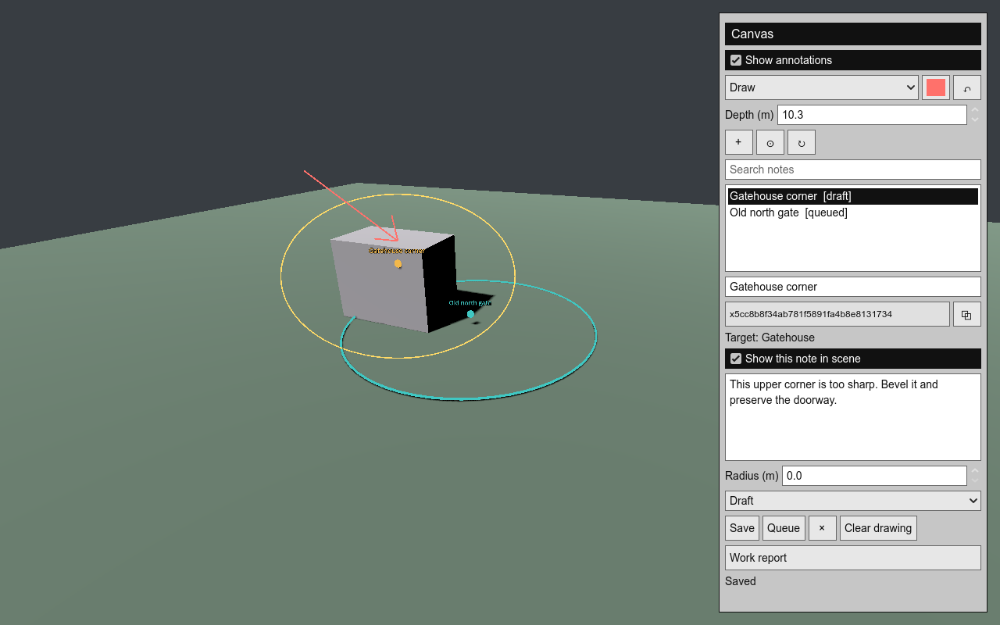
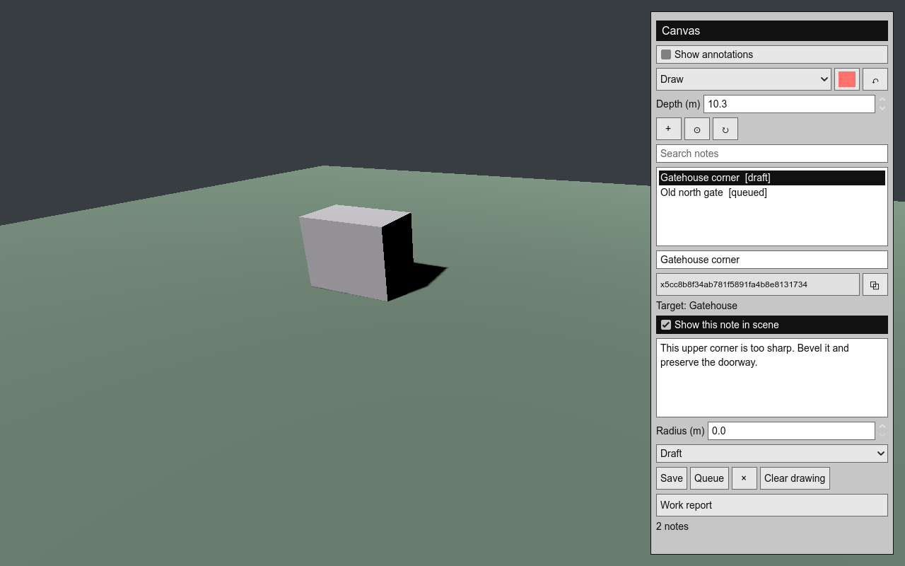

# Canvas

**Draw what you mean. Give your AI a place to work.**

Canvas turns marks in your project into persistent, addressable instructions.
Circle a model, sketch a path, highlight a broken corner, or pin a place to
build. Name the note and tell your AI what should change.

Created by **[born-lucky](https://github.com/born-lucky)**, an AI creator building
open tools for working directly with AI inside creative projects.



*Real Godot capture: the yellow loop is a mouse-drawn stroke stored as 3D
coordinates. The note identifies the enclosed Gatehouse object.*

**Annotations are optional, not permanent changes to your scene.** Hide all
with **Show annotations**, or hide a single note with **Show this note in scene**.
Per-note visibility is saved; hiding preserves the note and does not cancel
queued AI work. Press F8 to close Canvas and hide its overlay entirely.
**Clear drawing** removes a note's strokes; **×** deletes its saved note file,
including its instruction and annotation. Both require confirmation. Neither
action reverts game changes an AI has already made. Worker run logs are separate
history under `.canvas/runs/` and are not deleted with the note.



## Use It in Your Project

**Godot 4.5+:** a working adapter is included. Download the
[latest release](https://github.com/born-lucky/canvas/releases/latest), copy
`addons/canvas` into your project, and enable **Canvas** in
**Project Settings > Plugins**. Press **F8** while playing.
No Python or AI account is required to draw and save notes.

**Other engines and creative tools:** Canvas's files and queue are independent
of Godot. Give your AI this prompt to implement an adapter for your project:

```text
Integrate the Canvas annotation framework by born-lucky into this project:
https://github.com/born-lucky/canvas

Read INTEGRATE_WITH_AI.md, docs/PROTOCOL.md, and schema/note.schema.json.
Use the project's native UI and renderer. Add mouse-drawn annotations,
stable note IDs, object references, per-note project files, and AI task
export. Preserve existing project behavior and verify saving, reloading,
undo, and resolving a note ID. Keep the creator attribution and MIT license
in the integration's documentation. Report any unsupported capabilities.
```

The Godot adapter is ready today. Unity, Unreal, Blender, web editors, and
custom engines need their own adapter; the prompt is an integration brief,
not a promise of automatic compatibility. Contributions are welcome.

## Draw, Name, Instruct

1. Open Canvas with **F8** and choose **Draw**.
2. Drag the left mouse button to circle, underline, sketch, or scribble in 3D.
3. Name the note and write the change you want. Each note gets a permanent ID.
4. Press **Queue** to authorize work, or copy its ID into a conversation:
   "Fix the sharp corner at note x... without changing the doorway."
5. Review the AI's changes and report before marking the note **Done**.

**Draw** uses a camera-facing plane anchored at the first hit surface, or at
the chosen depth when starting in empty space. Strokes remain in world space
when you move the camera. **Surface** follows collision geometry. **Pin** places
individual markers; a radius adds a circular area highlight.

Select a note to add strokes to it. **+** starts a new drawing note. **Undo**
removes the latest stroke. **Esc** cancels an unfinished stroke. Choose ink
with the color swatch. **Copy** copies the permanent ID; search accepts IDs,
names, and instructions. Names can change without changing IDs.

Hold **right mouse** to look; while holding it, **WASD** flies, **Q/E** changes
height, and **Shift** increases speed. **@** focuses the selected note.
**R** refreshes notes and reports, replacing unsaved panel edits. **X** deletes
a note after confirmation. F8 restores normal gameplay.

The editor dock supports pins and displays saved drawings. Freehand capture is
currently a play-mode feature. The editor overlay uses the primary 3D viewport.

## Open Framework

Canvas consists of an **open note protocol**, a **Godot adapter**, and an
**optional local AI worker**. They share human-readable files:

```text
your-project/
  .canvas/
    notes.json                 # Storage-format manifest
    notes/
      x<permanent-id>.json      # One note: name, strokes, targets, instruction
    runs/                      # Optional worker reports and logs
```

The protocol can describe 3D space, 2D space using z=0, and object-based tools.
An adapter must declare its coordinate convention and implement native picking
and rendering. No engine dependency is required to read the files or run the
queue. See [the protocol](docs/PROTOCOL.md), [note schema](schema/note.schema.json),
and [AI integration brief](INTEGRATE_WITH_AI.md).

The files belong to your project and can be versioned in Git or read by other
agents. Existing combined notes migrate on the next save or worker update,
retaining IDs and a backup. A shared lock and atomic file replacement protect
writes; malformed notes are preserved and reported.

## Optional AI Worker

The worker requires Python 3.10+ and an installed, signed-in
[Codex CLI](https://learn.chatgpt.com/docs/non-interactive-mode). Other agents
can read the same notes or consume exported instructions.

```sh
git clone https://github.com/born-lucky/canvas.git
python canvas/canvas.py --project /path/to/project list
python canvas/canvas.py --project /path/to/project show NOTE_ID
python canvas/canvas.py --project /path/to/project export --id NOTE_ID
python canvas/canvas.py --project /path/to/project --workspace /path/to/repo work --watch
```

The worker processes queued notes one at a time, passing their instructions,
3D strokes, and object/source references to the AI. It uses `workspace-write`,
follows project instructions, and requests verification. Keep the computer
awake and connected. It does not automatically commit or push.

**Draft -> Queued -> Working -> Review -> Done.** Failures or timeouts become
Blocked. A successful CLI exit returns Review, even if its report describes
incomplete work. See [worker recovery](docs/WORKER.md) for interrupted jobs.
The local live worker check was blocked by Windows sandbox permissions;
automated worker tests use a simulated CLI, not verified AI asset repairs.

Drawing on a model supplies context for the AI; it does not itself repair the
mesh. The current worker edits project files. **Streaming AI construction into
a running scene and automatic asset hot reload are not implemented yet.**

## Current Boundaries

- Godot 4.5 on Windows is tested locally; other platforms are unverified.
- Object picking and Surface drawing require collision geometry. Empty-space
  Draw works at a chosen depth. Inspect the displayed Target before queuing.
- Object references are hints; renamed nodes or regenerated maps may need retargeting.
- Strokes are fixed world-space annotations, not moving-object attachments.
- Surveying pauses gameplay and uses loaded geometry, without driving streaming.
- Other engine adapters, live editing, and cloud workers are future work.

## Develop and Contribute

```sh
python -m unittest discover -s tests -v
godot --headless --path . --editor --import --quit
godot --headless --path . --script res://tests/runtime_test.gd
godot --path . --script res://tests/runtime_test.gd
```

Godot must print `CANVAS_TEST_OK`; the rendered test also saves a screenshot.
Tests cover mouse-event drawing, surface strokes, object targeting, undo, IDs,
persistence, migration, locks, malformed data, and camera/pause restoration.
Worker tests simulate the CLI rather than spend AI credits or mutate a project.

See [CONTRIBUTING.md](CONTRIBUTING.md) and [CHANGELOG.md](CHANGELOG.md).
Built alongside [Feitoria: Lands Eternal](https://github.com/born-lucky/feitoria-lands-eternal),
but the addon contains no Feitoria assets or game logic.

## Creator and License

**Canvas is an open project by [born-lucky](https://github.com/born-lucky).**
Follow the creator for AI-built tools and creative projects. Use Canvas in
personal or commercial projects, adapt it, and share integrations.
The [MIT license](LICENSE) requires retaining the copyright and license notice.
